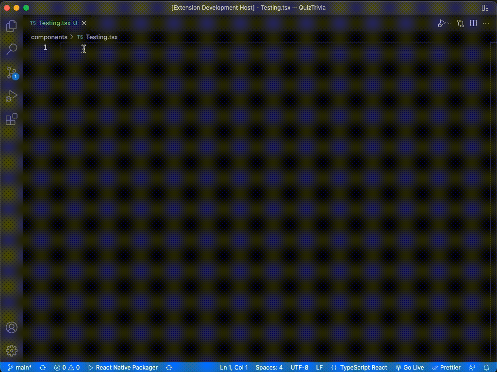
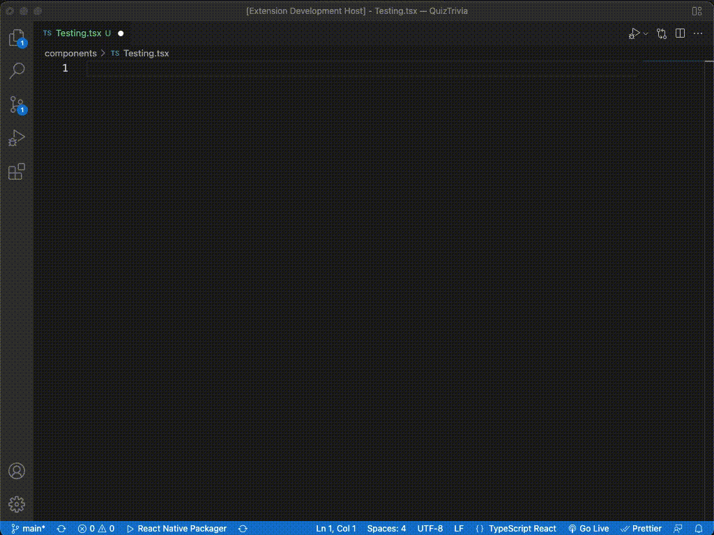
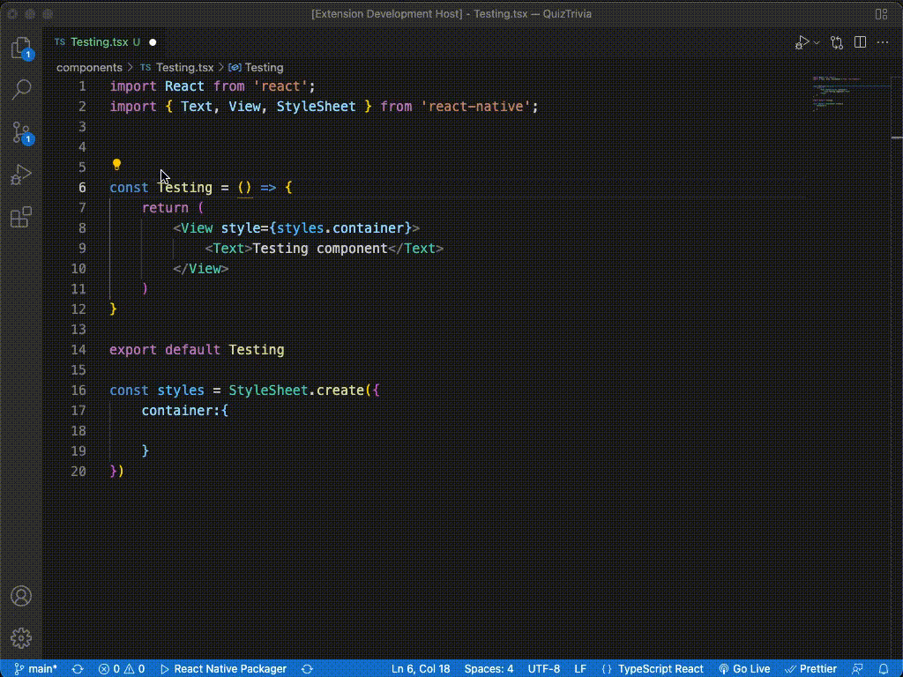

# React Native Typescript Snippets

Easily generate pre-written snippets when working with typescript in React Native or React.

## Features

- Boiler plate code for typescript React Native
- Generate function module with type interface
- Generate type interface
- Works with both React and React Native

## Screenshots
1. Generate boiler plate code for Typescript with React Native including type interface and StyleSheet.
### prefix: rntfs

2. Generate boiler plate code for Typescript with React Native including type interface.
### prefix: rntf

3. Generate type interface.
### prefix: rntp

## 🚀 About Me
My name is Brijen Makwana and i'm a Software Developer building Mobile Applications that have good impact on society. YouTube Content Creator and Content Writer in free time ✍🏻🎥

